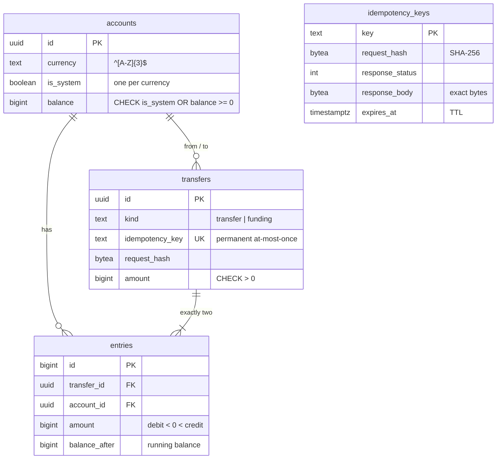
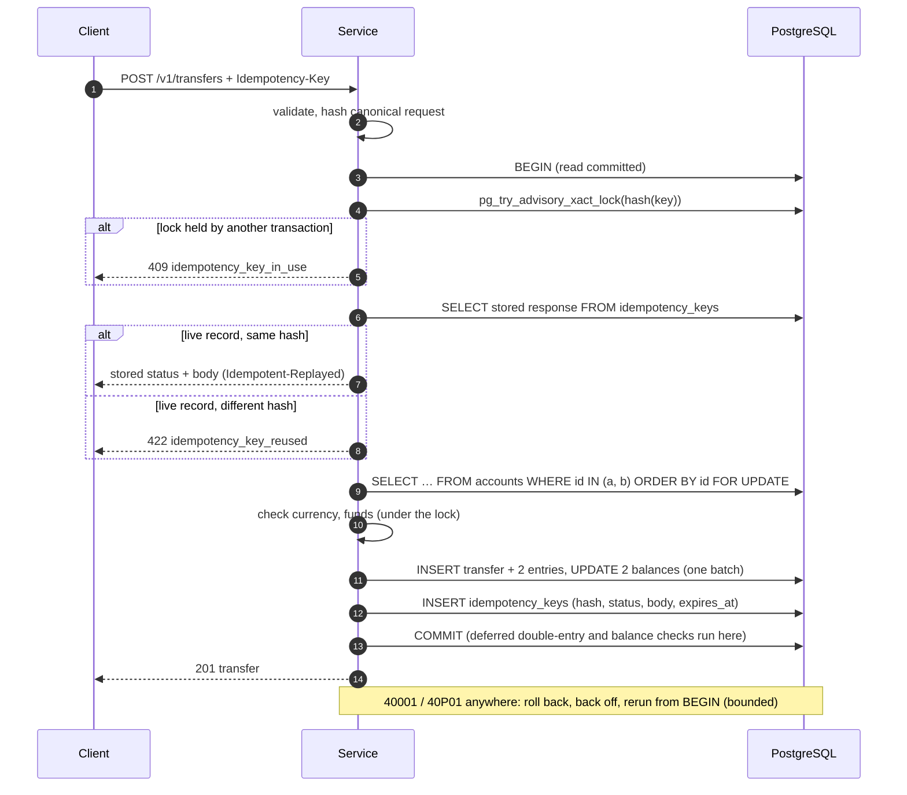

# Idempotent Payments Ledger

[](https://github.com/jsankalp715/Idempotent-Payments-Ledger-/actions/workflows/ci.yml)

A double-entry ledger HTTP service in Go and PostgreSQL. Transfers execute **exactly once**
even when clients retry, time out or lose responses, and **no account can be overdrawn or
double-spent** under any amount of concurrency. Every guarantee below has a test that tries
to break it, and the stress test, overdraft race and deadlock test run in GitHub Actions on
every push.

Go 1.26+ · `net/http` · pgx/v5 · goose · slog · PostgreSQL 16 · Docker. No ORM; money is
`BIGINT` minor units, never floats.

## Guarantees and how they are proven

| Guarantee | Mechanism | Proof (test) |
|---|---|---|
| A retried request never executes twice | Idempotency key record and transfer committed in **one transaction**; replay returns the stored status and body bytes | `TestSameKeySamePayloadReplaysTheOriginalResponse`, stress test (lost responses, timeouts, duplicates) |
| A key reused for a different request is rejected | SHA-256 hash of the canonical request stored with the key → **422** | `TestSameKeyDifferentPayloadIs422`, `TestFingerprint*` |
| A duplicate sent while the original is still running is not queued or executed | `pg_try_advisory_xact_lock(hash(key))` → **409** immediately | `TestSameKeyWhileInFlightIs409`, `TestConcurrentRequestsWithOneKeyExecuteOnce` |
| A crash or error never leaves a key without its transfer (or the reverse) | Same transaction; failure injected after the transfer write | `TestKeyRecordAndTransferCommitTogether`, `TestDoCommitsTheRecordAndTheWorkAtomically` |
| A key never moves money twice, **even after its record expires** | `UNIQUE (transfers.idempotency_key)`; the response is rebuilt from immutable rows | `TestExpiredKeyNeverMovesMoneyTwice` |
| No overdraft under concurrency | `SELECT … FOR UPDATE` on both accounts, balance checked under the lock; `CHECK (balance >= 0)` as a second line of defence | `TestOverdraftRace` (exactly ⌊balance/amount⌋ of N succeed), `TestNonSystemBalanceCannotGoNegative` |
| No deadlocks | Both rows locked in ascending id order, in one statement | `TestOpposingTransfersDoNotDeadlock` (0 deadlocks in 800 opposing transfers); `TestTxRunnerRecoversFromARealDeadlock` shows the opposite-order cycle and its recovery |
| Transient conflicts are absorbed, never cached | Bounded retry with full-jitter backoff on `40001` / `40P01`; exhausted retries → **503**, retryable with the same key | `TestTransientFailuresAreRetriedTransparently`, `TestExhaustedRetriesReturn503AndAreNotCached`, stress test under `SERIALIZABLE` |
| Double entry: two entries per transfer, summing to zero | Deferred constraint triggers check every transfer at commit | `TestUnbalancedTransfersAreRejected`, invariant (d) |
| Balances are derivable from entries | Running `balance_after` chain enforced per entry; cached balance must equal the latest one at commit | `TestBalanceChangeWithoutEntriesIsRejected`, `TestEntryChainMustContinuePreviousBalance`, invariant (c) |
| The ledger is append-only | Triggers reject `UPDATE`, `DELETE` and `TRUNCATE` on entries and transfers | `TestEntriesAndTransfersAreAppendOnly` |

The stress test then checks five global invariants with independent SQL
([`internal/ledgertest/invariants.go`](internal/ledgertest/invariants.go)): **(a)** money
is conserved, **(b)** no negative balances, **(c)** every balance equals the sum of its
entries, **(d)** all entries sum to zero, **(e)** every idempotency key was applied at most
once. On top of that it compares every balance with the client's own bookkeeping, and
checks that the database holds exactly the transfers the client was told about.

## Quick start

```sh
docker compose up --build -d --wait     # Postgres 16 + the service on :8080
scripts/smoke.sh                        # end-to-end check: replay, 422, overdraft, balances
docker compose down -v
```

Then try it by hand:

```sh
J='Content-Type: application/json'
A=$(curl -s -XPOST localhost:8080/v1/accounts -H "$J" -d '{"currency":"USD","initial_balance":10000}' | jq -r .id)
B=$(curl -s -XPOST localhost:8080/v1/accounts -H "$J" -d '{"currency":"USD"}' | jq -r .id)

# Send it twice: the second response is the stored original, marked Idempotent-Replayed.
for i in 1 2; do
  curl -si -XPOST localhost:8080/v1/transfers -H "$J" -H 'Idempotency-Key: order-42' \
       -d "{\"from_account\":\"$A\",\"to_account\":\"$B\",\"amount\":2500,\"currency\":\"USD\"}"
done
curl -s localhost:8080/v1/accounts/$A          # balance 7500, not 5000
```

### Local development without Docker

```sh
service postgresql start && scripts/dev-db.sh   # role "ledger", databases ledger and ledger_test
make test          # unit + integration + CI-sized stress (needs DATABASE_URL, defaulted by make)
make race          # whole suite under -race, three shuffled runs
make stress-large  # 12,000 transfers, 200 goroutines, 20 accounts
make verify        # everything above plus serializable and 30k-transfer runs (~3 min)
make lint          # gofmt, go vet, staticcheck
make run           # the service on :8080 against the "ledger" database
```

## API

All bodies are JSON. Amounts are integers in minor units (cents), at most 10^15.

| Method and path | Purpose | Success |
|---|---|---|
| `POST /v1/accounts` | Create an account: `{"currency":"USD","initial_balance":10000}`. `initial_balance` is optional and is moved in from the currency's system account. `Idempotency-Key` optional. | 201 account |
| `GET /v1/accounts/{id}` | Account with its current balance | 200 account |
| `GET /v1/accounts/{id}/entries?limit=50&cursor=…` | The account's entries, newest first, each with `balance_after`; follow `next_cursor` | 200 page |
| `POST /v1/transfers` | `{"from_account","to_account","amount","currency"}`. **`Idempotency-Key` required.** | 201 transfer |
| `GET /v1/transfers/{id}` | A transfer and its two entries | 200 transfer |
| `GET /healthz` | Database reachability; 503 while draining during shutdown | 200 |

A transfer response:

```json
{
  "id": "01a104e3-6a58-7e51-a035-6141a40d6d25",
  "kind": "transfer",
  "from_account": "01a104e3-6a1f-76cf-abe5-589593b5d76e",
  "to_account": "01a104e3-6a40-7166-a964-ad9a47e51cd4",
  "amount": 2500,
  "currency": "USD",
  "created_at": "2026-10-04T03:09:35.190704Z",
  "entries": [
    {"id": 5, "account_id": "01a104e3-6a1f-…", "direction": "debit",  "amount": -2500},
    {"id": 6, "account_id": "01a104e3-6a40-…", "direction": "credit", "amount": 2500}
  ]
}
```

Errors share one envelope: `{"error":{"code":"insufficient_funds","message":"…","fields":[…]}}`.

### Idempotency semantics for `POST /v1/transfers`

| Situation | Response | Stored? |
|---|---|---|
| First request with a key | 201, or 422 for a business rejection | yes, with the request hash |
| Same key, same request (any JSON formatting) | the stored status and body, byte for byte, plus `Idempotent-Replayed: true` | already |
| Same key, different request (or different endpoint) | 422 `idempotency_key_reused` | no |
| Same key while the first request is still running | 409 `idempotency_key_in_use`, `Retry-After: 1` | no |
| Invalid request (400) or missing/malformed key | 400 | no: nothing executed |
| Transient failure: conflicts after all retries, timeout, database down | 503 `transaction_conflict` / `timeout`, `Retry-After: 1` | no: nothing committed, retry with the same key |
| Business rejection (`insufficient_funds`, `account_not_found`, `currency_mismatch`, `system_account_not_allowed`) | 422 | yes: a retry cannot turn a rejection into a payment later |
| Same key after the 24 h TTL, same request | the original 201 rebuilt from the immutable transfer | re-stored |
| Same key after the TTL, for a request that was rejected | executes as a new request (it never moved money) | yes |

**Why 409 for in-flight duplicates instead of waiting?** A duplicate that arrives while the
original is running is almost always a client retry after a timeout. Blocking it would tie
up a connection and a database session behind a lock the client already gave up on, and
those waits pile up exactly when the system is slow. An immediate 409 with `Retry-After`
is cheap, cannot execute anything, and the client's next retry gets the stored result.

## Design

### Data model



Money enters the ledger only through a per-currency **system account**, which is the source
of every funding transfer and is the only account allowed to go negative. Its balance is
the negated sum of all user balances, so the per-currency total is always zero: that is
invariant (a). Client transfers cannot touch system accounts.

The schema enforces the ledger rules itself
([`migrations/00001_ledger.sql`](internal/postgres/migrations/00001_ledger.sql)), so a bug
or a stray manual query cannot corrupt money: append-only triggers, a deferred
double-entry check, the running-balance chain, cached-balance consistency at commit,
`CHECK (balance >= 0)`, composite `(id, currency)` foreign keys that keep currencies
consistent, and `UNIQUE (idempotency_key)` on transfers.

### One idempotent transfer



Every failure before COMMIT rolls back the transfer **and** the key together, so the
client's retry starts from scratch. If the connection dies during COMMIT the outcome is
unknown to the server, but not to the ledger: the client retries with the same key and
either replays the committed result or executes for the first time.

### Concurrency

* **Pessimistic row locks, deterministic order.** `ORDER BY id FOR UPDATE` sorts before
  locking, so any two transfers over the same accounts request the locks in the same order.
  A lock cycle, and therefore a deadlock, cannot form.
* **Read committed by default.** Correctness comes from the explicit locks, not the
  isolation level: a `FOR UPDATE` read under read committed returns the latest committed
  balance. `TX_ISOLATION=serializable` is supported; CI runs the stress and integration
  suites with it to exercise the retry path for real (tens of thousands of serialization
  failures per run, ledger still exact).
* **Bounded retries.** `40001` and `40P01` restart the whole transaction after
  full-jitter exponential backoff (5 ms base, 250 ms cap, 8 attempts by default). Only
  errors that guarantee a rollback are retried. Ambiguous ones (a dead connection during
  COMMIT) go back to the client, whose idempotent retry is safe.
* **Prompt cancellation.** When a client disconnects or a request times out, pgx asks
  PostgreSQL to cancel the running statement, so the backend releases its locks at once
  instead of waiting on a dead socket.
* **Hot rows.** Throughput is bounded by contention on the busiest accounts (about
  1,400 transfers/s over 20 accounts on a 4-vCPU VM). The system account is locked by every
  funding, which is acceptable because funding happens once per account.

### Operations

* Configuration through environment variables (see below); invalid values are all reported
  at once.
* Migrations are embedded and applied on start (`MIGRATE_ON_START`), guarded by an advisory
  lock so concurrent instances do not race; `ledger migrate` runs them alone.
* Graceful shutdown: on SIGTERM `/healthz` reports `draining` for `SHUTDOWN_DRAIN_DELAY`,
  then the listener closes and in-flight requests get `SHUTDOWN_TIMEOUT` to finish. Requests
  still running after that are cancelled, so their transactions roll back cleanly.
* A background job deletes expired idempotency records in batches with
  `FOR UPDATE SKIP LOCKED`, so several instances can run it at once.
* Structured JSON logs (slog) with a request id (`X-Request-ID`, generated or propagated),
  status, latency, idempotency key and replay flag.
* The container image is a static binary on distroless (non-root, about 22 MB) with a
  `HEALTHCHECK` built into the binary (`ledger healthcheck`).

## Configuration

| Variable | Default | Meaning |
|---|---|---|
| `DATABASE_URL` | (required) | PostgreSQL connection string |
| `HTTP_ADDR` | `:8080` | listen address |
| `LOG_LEVEL` / `LOG_FORMAT` | `info` / `json` | `debug…error` / `json` or `text` |
| `DB_MAX_CONNS` / `DB_MIN_CONNS` | `20` / `2` | connection pool size |
| `TX_ISOLATION` | `read_committed` | or `repeatable_read`, `serializable` |
| `TX_MAX_ATTEMPTS` | `8` | runs per transaction, including retries |
| `TX_RETRY_BASE_DELAY` / `TX_RETRY_MAX_DELAY` | `5ms` / `250ms` | backoff shape |
| `IDEMPOTENCY_TTL` | `24h` | how long responses are stored and replayed |
| `IDEMPOTENCY_CLEANUP_INTERVAL` / `_BATCH` | `10m` / `1000` | expired-record cleanup |
| `REQUEST_TIMEOUT` | `10s` | server-side deadline per request |
| `SHUTDOWN_DRAIN_DELAY` / `SHUTDOWN_TIMEOUT` | `0s` / `20s` | graceful shutdown phases |
| `MIGRATE_ON_START` | `true` | apply migrations at startup |

## Testing

| Layer | Where | What |
|---|---|---|
| Unit | `internal/*/…_test.go` | validation, request hashing, key format, retry classification and backoff, config parsing |
| Schema | `internal/postgres/schema_test.go` | raw SQL against the schema: append-only, double entry, balance chain, CHECK, currency FKs |
| Integration | `test/integration` | every idempotency case through real HTTP and real Postgres, with faults injected by triggers; validation; business rules; overdraft race; opposing transfers; graceful shutdown |
| Stress | `test/stress` | thousands of transfers from many goroutines with lost responses, mid-flight client timeouts, pre-cancelled requests, racing and late duplicates; invariants (a) to (e), exact balances, at-most-once per key |

Database tests read `DATABASE_URL`. Each test gets a private, freshly migrated schema, so
packages run in parallel against one database. Without `DATABASE_URL` they skip, unless
`LEDGER_REQUIRE_DB=1` (as in CI), which turns a missing database into a failure.

Stress test size is set by environment variables:

```sh
make stress                                   # CI size: 3,000 transfers, 64 goroutines, 20 accounts
make stress-large                             # 12,000 transfers, 200 goroutines, 20 accounts
TX_ISOLATION=serializable make stress         # same, with SERIALIZABLE transactions
STRESS_TRANSFERS=50000 STRESS_WORKERS=400 STRESS_SEED=42 go test -run TestStress -v ./test/stress
```

A typical large run on a 4-vCPU VM, from the test's own log:

```
12000 transfers in 8.638s (1389/s) by 200 goroutines over 20 accounts
requests sent 19563: responses lost 1179, client timeouts 1185, pre-cancelled 362,
  409 in flight 2383, 503 transient 0, replays 3633
outcomes: 10602 executed, 1398 rejected for insufficient funds
invariants hold over 21 accounts, 10622 transfers, 21244 entries, 12000 idempotency records
```

CI ([`.github/workflows/ci.yml`](.github/workflows/ci.yml)) runs on every push: gofmt,
`go mod tidy`, vet, staticcheck and govulncheck; the whole suite under `-race -count=3
-shuffle=on` on both supported Go releases against a Postgres 16 service container; large
stress under read committed and serializable; the integration suite under serializable;
and a Docker job that builds the image, runs the compose stack, smoke-tests it and checks
graceful shutdown.

## Project layout

```
cmd/ledger/            entrypoint: serve | migrate | healthcheck
internal/config/       environment configuration
internal/postgres/     pool, embedded migrations, retrying transaction runner
internal/ledger/       accounts, transfers, entries: business rules and SQL
internal/idempotency/  request hashing, key store (Do), TTL cleanup
internal/httpapi/      handlers, middleware, error mapping
internal/app/          wiring and graceful shutdown
internal/testdb/       per-test schema helper
internal/ledgertest/   in-process server, API client, invariant checker
test/integration/      black-box HTTP + database tests
test/stress/           concurrent stress test with failure injection
docs/                  PLAN.md (milestones), DECISIONS.md (design decisions)
```

## Limitations and next steps

* **No authentication or tenancy.** Idempotency keys are global; a production version
  would scope them per API client, `PRIMARY KEY (client_id, key)`, and authorize access to
  accounts.
* **Single currency per transfer.** FX would need a quote and four entries through
  currency-specific system accounts.
* **Hot accounts serialize.** A very busy account (a merchant) would need sharded
  sub-accounts or batched settlement.
* **Defence in depth via privileges.** The append-only rules are triggers. A deployment
  could also run migrations as an owner role and the service as a role with only `INSERT`
  and `SELECT` on ledger tables.
* **Metrics.** Logs carry everything needed; a Prometheus endpoint (retry counters are
  already collected in `postgres.RetryStats`) would be the next step.

Design decisions and their alternatives are recorded in [docs/DECISIONS.md](docs/DECISIONS.md).
